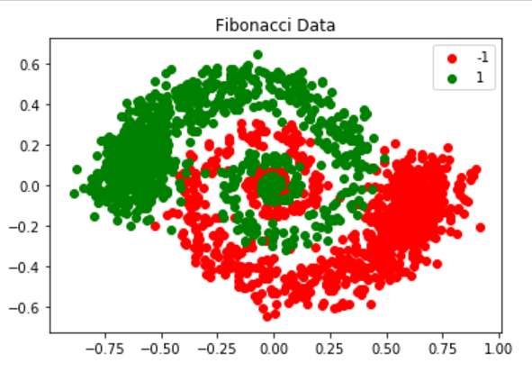
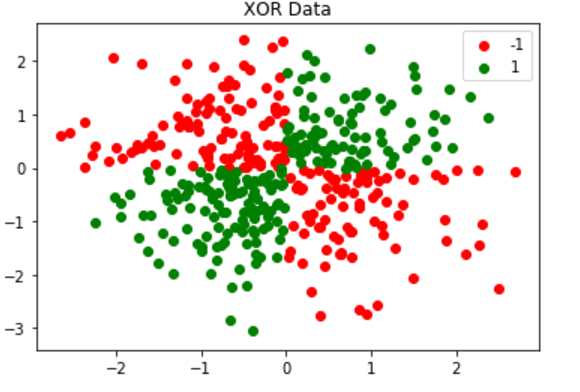

# Custom Build SVM Classifier From Scratch

The goal of this project is to build a classifier froam a scratch instead of using the one that comes with Scikit-learn. Then, use the classifier to classify Fibonacci and XOR data. 

In here, SVM classifier is developed using linear and RBF kernel.

For a linear classifiier,

![](http://latex.codecogs.com/gif.latex?%5Cbg_white%20y_i%20%3D%20w%5ETX_i%20&plus;%20b%20%5C%5C%20where%20%5C%20%5C%20w%20%3D%20%5Csum_i%20%5Calpha_iX_i%2C%20%5C%20%5C%20%5C%20%5C%20b%20%3D%20%5Csum%20%5Calpha%20%5C%5C%20X_i%20%5C%20is%20%5C%20trainin%20feature%20%5C%5C%20y_i%20%5C%20is%20%5C%20training%20%5C%20label%20%5C%5C%20%5C%5C%20y_i%20%3D%20%5Csum_i%20%5Calpha_iX_i%5ETX_j%20%5C%20&plus;%20%5C%20%5Csum%20%5Calpha%20%5C%5C%20y%20%3D%20%5Calpha%20X%5ETX%20%5C%20&plus;%20%5C%20%5Csum%20%5Calpha%20%5C%5C%20y%20%3D%20%5Calpha%20K%20%5C%20&plus;%20%5C%20%5Calpha%20%5Csum%201%20%5C%5C%20y%20%3D%20%5Calpha%20%28K%20&plus;%201%29%20%5C%5C%20K%3A%20%5C%20Kernel%20%5C%20Matrix%20%3D%20X_%7Btrain%7D%5ETX_%7Btrain%7D%20%5C%20for%20%5C%20linear%20%5C%20classifier%20%5C%5C%20For%20%5C%20RBF%20%5C%20kernel%2C%20%5C%5C%20K%20%3D%20exp%5Cleft%28%20%5Cfrac%7B%7C%7CX_%7Btrain%7D%20-%20X_%7Btrain%7D%7C%7C%5E2%7D%7B2%5Csigma%5E2%7D%20%5Cright%20%29%20%5C%5C%20%5C%5C%20Now%2C%20%5C%5C%20%5Calpha%20%3D%20%5Cleft%28K%20&plus;%201%20%5Cright%20%29%5E%7B-1%7Dy%20%3D%20%5Cwidetilde%7BK%7D%5E%7B-1%7Dy%20%5C%5C)

Since, the expression above involves inverse calculation. So if the eigenvalues of the matrix are close to 0, it will cause insatbility in our model. Hence, to prevent the posiible instability, we can add a small positive integer - gamma - in the main diagonal of the matrix K.

Now, let's predict the output;

### K-Fold Cross Validation
Any machine learning model involves a lot of random selection throughout the process. We may get a higher accuracy when we run a model. But, when we use the same model next time, we may get get much lower accuracy. So, instead of decising the performance of a model just from one iteration, we can run the model multiple times & calculate the error from each iteration and then calculate average error. This approach will give us a more accurate performance measure.

To acheive this, K-fold cross validation technique is used in this project. The value of K is chosen to be 5. Meaning, each classifier is trained and evaluate 5 times before measuring accuracy of the model.

### Grid Search Approach
There are many hyperparameters that needs to be selected before using them in a classifier. We normally choose these parameters randomly using our intuition. But we never know which selection gives us the most accurate model. Grid search method is a great way determine the best selection of hyperparameters.

Grid search is a method in which we create a grid of parameters. Then we use each possible combinations of parameters in the classifier  and train and evaluate the model. Finally, we select the parameters which produces least classification error.
